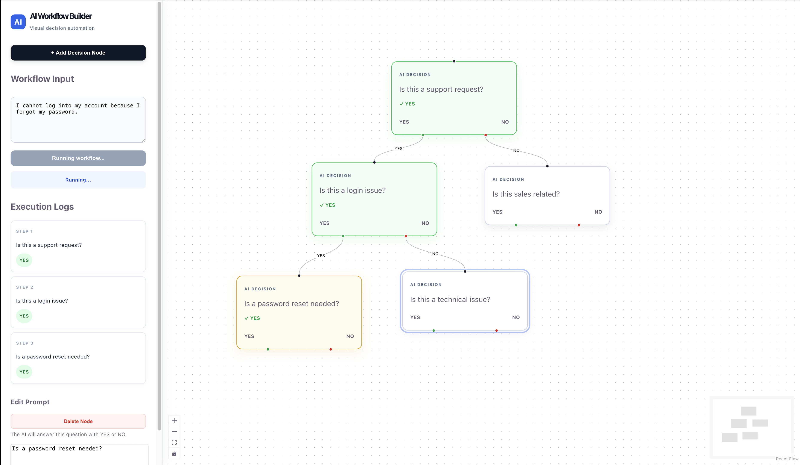

# AI Workflow Builder

A visual AI workflow system where users can build decision flows using nodes and execute them with AI-powered `YES` / `NO` branching.

The workflow editor is built with React Flow, while workflow execution is handled by FastAPI, Inngest, and the OpenAI API.

## Overview

Users can visually create a decision workflow by:

- Adding AI decision nodes
- Writing a prompt for each node
- Connecting nodes through `YES` and `NO` paths
- Providing an input to evaluate
- Running the workflow
- Viewing the execution path and AI decisions

Each decision node sends its prompt together with the workflow input to the OpenAI API.

The model returns only:

```text
YES
```

or:

```text
NO
```

The workflow then follows the corresponding edge to the next node.

---

## Example

```text
Input:
"I cannot log into my account because I forgot my password."

                         YES
[Is this a support request?]
          |
          YES
          ↓
[Is this a login issue?]
          |
          YES
          ↓
[Is a password reset needed?]
```

Execution result:

```text
Step 1
Is this a support request?
→ YES

Step 2
Is this a login issue?
→ YES

Step 3
Is a password reset needed?
→ YES
```

---

## Tech Stack

### Frontend

- React
- TypeScript
- Vite
- React Flow (`@xyflow/react`)
- Shadcn UI

### Backend

- Python
- FastAPI
- Inngest
- OpenAI SDK

---

## Architecture

```text
React Flow
     |
     | nodes + edges + workflow input
     v
FastAPI
     |
     | workflow/run event
     v
Inngest
     |
     | executes each node as a step
     v
OpenAI API
     |
     | YES / NO
     v
Next workflow edge
```

React Flow is responsible for building and visualizing the graph.

FastAPI receives the workflow from the frontend and sends a `workflow/run` event to Inngest.

Inngest executes each visited node as an individual step.

During each step, the backend sends the node prompt and workflow input to the OpenAI API.

The returned `YES` or `NO` decision determines which edge is followed next.

---

## Features

- Visual workflow editor
- Custom AI decision nodes
- Editable node prompts
- `YES` and `NO` branching
- Drag-and-drop node positioning
- Dynamic workflow traversal
- OpenAI-powered decisions
- Inngest step-based execution
- Local workflow persistence
- Execution logs
- Visual execution state
- Workflow validation
- Error handling
- Node deletion
- Cycle protection

---

## Project Structure

```text
ai-workflow-builder/
│
├── backend/
│   ├── main.py
│   ├── requirements.txt
│   ├── .env
│   └── .env.example
│
├── frontend/
│   ├── src/
│   │   ├── components/
│   │   │   └── DecisionNode.tsx
│   │   ├── App.tsx
│   │   └── main.tsx
│   │
│   ├── package.json
│   └── vite.config.ts
│
├── .gitignore
└── README.md
```

> `.env` is excluded from Git and should never be committed.

---

# Getting Started

## 1. Clone the repository

```bash
git clone https://github.com/MertDikdas/ai-workflow-builder.git
cd ai-workflow-builder
```

---

## 2. Frontend Setup

```bash
cd frontend
npm install
npm run dev
```

The frontend runs at:

```text
http://localhost:5173
```

---

## 3. Backend Setup

Open another terminal:

```bash
cd backend

python3 -m venv .venv

source .venv/bin/activate

pip install -r requirements.txt
```

Start FastAPI:

```bash
INNGEST_DEV=1 python -m uvicorn main:app --reload
```

The backend runs at:

```text
http://localhost:8000
```

FastAPI documentation:

```text
http://localhost:8000/docs
```

---

## 4. Environment Variables

Create:

```text
backend/.env
```

using:

```text
backend/.env.example
```

Example:

```env
OPENAI_API_KEY=your_openai_api_key
OPENAI_MODEL=your_openai_model

INNGEST_DEV=1
INNGEST_EVENT_API_BASE_URL=http://localhost:8288
```

Never commit your real API key.

---

## 5. Start Inngest

Open another terminal from the project directory:

```bash
inngest dev -u http://localhost:8000/api/inngest
```

If the CLI is stored locally instead:

```bash
./inngest dev -u http://localhost:8000/api/inngest
```

The Inngest Dev Server is available at:

```text
http://localhost:8288
```

---

# Running a Workflow

Create decision nodes in the React Flow editor.

For example:

```text
Is this a support request?
```

Connect its `YES` and `NO` handles to other nodes.

Enter an input:

```text
I cannot login to my account.
```

Press:

```text
Run Workflow
```

The frontend sends the complete graph to FastAPI:

```json
{
  "input": "I cannot login to my account.",
  "nodes": [],
  "edges": []
}
```

FastAPI forwards the workflow as an Inngest event.

Inngest finds the starting node and executes it as a step.

The backend sends the current node prompt to the OpenAI API.

If the AI returns:

```text
YES
```

the workflow follows the `YES` edge.

If it returns:

```text
NO
```

the workflow follows the `NO` edge.

Execution continues until no matching outgoing edge exists.

---

# Execution

Each visited node maps to an Inngest step:

```python
decision = await ctx.step.run(
    f"node-{node_id}",
    run_ai_node,
)
```

This makes individual AI decision steps visible through the Inngest execution system.

The application also records execution order so the frontend can display results such as:

```text
Step 1 → YES
Step 2 → NO
Step 3 → YES
```

---

# Error Handling

The application validates workflows before execution.

Examples include:

```text
Workflow input cannot be empty
All nodes must have a prompt
Workflow must contain at least one node
Workflow must have exactly one start node
```

Cycles are also detected during execution to prevent infinite workflow traversal.

OpenAI or execution errors are reported through the workflow status and displayed in the frontend.

---

# Local Persistence

Nodes and edges are stored in browser `localStorage`.

This means refreshing the page does not remove the current workflow.

---

# Development Services

When developing locally, three services should be running:

```text
Frontend
http://localhost:5173

FastAPI
http://localhost:8000

Inngest
http://localhost:8288
```

---

## Author

**Mert Dikdas**

GitHub: [MertDikdas](https://github.com/MertDikdas)